# AWS DID 用户手册

## 目录
- [1 简介](#1-简介)  
- [2 如何使用](#2-如何使用)
  - [2.1 入门](#21-入门-获得你的第一把-did-钥匙)
  - [2.2 使用DID登录](#22-使用did登录)
  - [2.3 普通用户登录 AWS](#23-普通用户登录-AWS)
  - [2.4 AWS SAML 配置](#24-aws-saml-配置)
  - [2.5 注册并配置组织用户](#25-注册并配置组织用户)

## 1 简介

AWS-Demo 是一个基于以太坊区块链上的 IDHub 去中心化身份 (DID) 合约进行认证和授权的应用案例。AWS-Demo 能够提供：
 1. AWS 用户使用以太坊钱包登录后台管理系统。
 1. AWS 用户将指定的操作权限开放给指定的以太坊用户。
 1. 操作权限的设定可以通过区块链上的智能合约进行编程，让数字货币与登录、操作权限关联，扩展出意想不到的商业模式。(In Process)

## 2 如何使用

### 2.1 入门: 获得你的第一把 DID 钥匙
在 IDHub DID 中，任何以太坊地址默认是其同名 DID，这意味着只要你拥有以太坊钱包就获得了 DID。AWS-Demo 现已支持 metamask 钱包登录。下载 [metamask](https://metamask.io)，获取你的第一把 DID 钥匙吧。

> 提示：
1. 想成为我们当中的一员或者有任何问题请与我们联系: support@idhub.network。
2. [英文版用户手册](./user_manual_EN.md)仍在完善中，欢迎提PR.

### 2.2 使用DID登入
安装好 metamask 钱包后，我们用它来登录“IDHub 身份提供商”的管理平台。
 1. 进入 ‘登入’ 页面并输入你的DID
 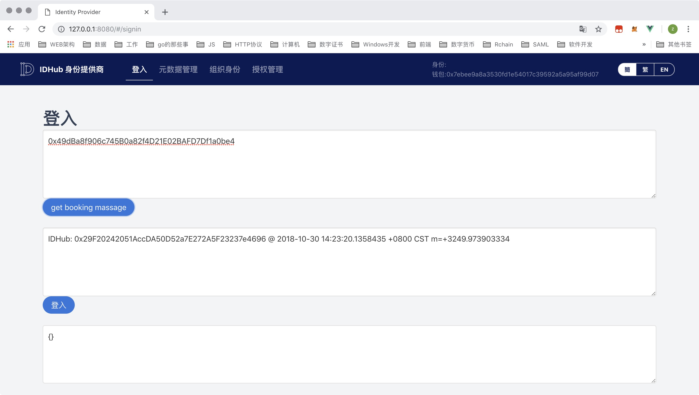
 1. 点击 ‘get booking massage’ 按钮获得签名信息
 1. 点击 ‘登⼊’ 按钮
 1. 弹出 metamask 界⾯并点击 ‘sign’ 进⾏签名
 
 1. 签名之后会自动提交进行验证
 1. 验证成功后进入 aws-demo 系统
 

### 2.3 普通用户登入 AWS
完成登录操作后，您已经成为IDHub的一名普通用户。IDHub 为用户提供的第一个功能是登录 AWS (Amazon Web Service)，IDHub 使用的服务器就运行在 AWS 上，并且开放了查看权限。完成这节的操作，你将可以任意浏览 IDHub 开发服务器部署和运行情况。

 1. 使用DID登录 aws-demo ，然后进入 ‘授权管理’ 页面并点击 ‘申请授权’ 按钮
 
 1. 查看并选择合适的由组织用户提供的角色，然后点击 ‘apply’ 按钮，此时 ‘apply status’ 变为0表示待审核状态
 
 1. 把您的“DID 地址”发送至 support@idhub.network 邮箱，等待组织用户审批申请（参考第2.5节 ‘注册并配置组织用户’ 第9步骤）
 
 1. 组织用户审批通过之后，普通用户可以在 ‘授权管理’ 页面点击 ‘申请授权’ 按钮查看到申请成功信息： ‘apply status’变为1代表申请成功
 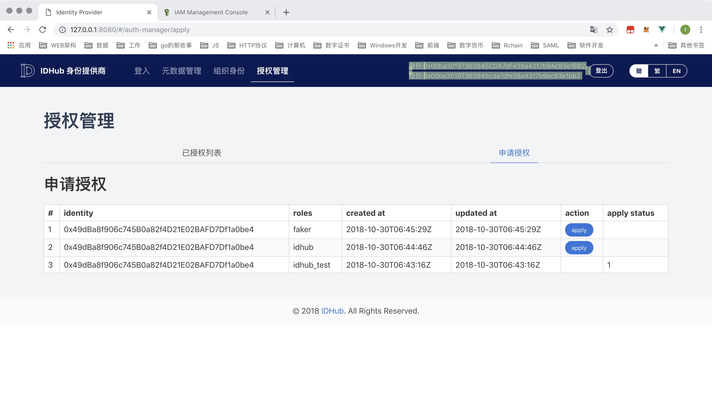
 1. 普通用户点击 ‘已授权列表’ 查看已获得的授权信息
 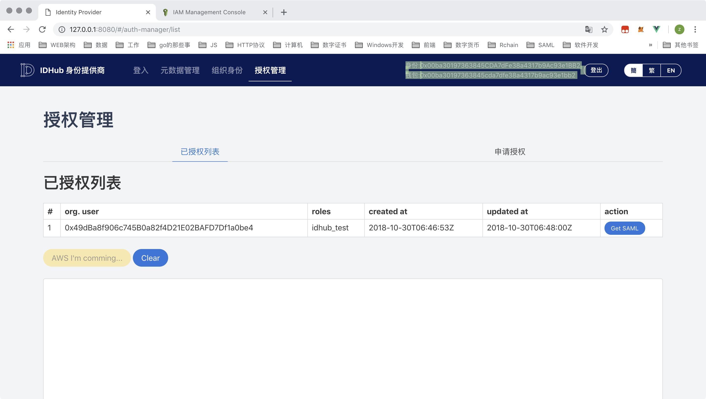
 1. 点击 ‘Get SAML’ 获取 SAML_RESPONSE ，它会显示在文本框中
 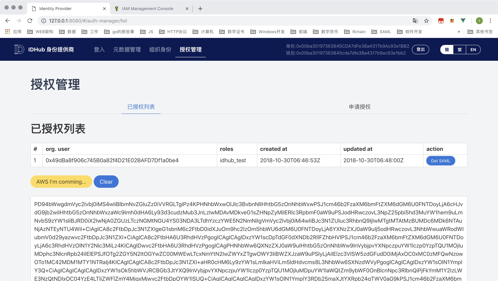
 1. 点击 ‘AWS I’m comming…’ 按钮就可以使用 SAML_RESPONSE 登录 AWS 网站
 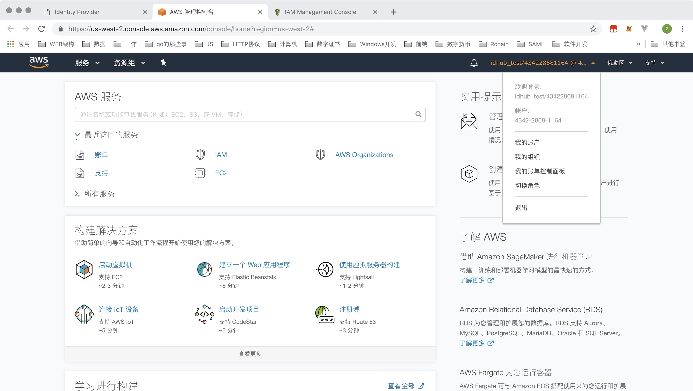

### 2.4 AWS SAML 配置
已经获得了IDHub的查看权限了吗？Cool! 如果您是一名开发者，可以把自己的服务器权限开放出来，并成为一名组织用户。这节我们介绍 AWS SAML 的基本配置，如果您已熟悉 SAML 和联合身份，也可以快速的浏览一遍，然后进入到下一节: [2.5 注册并配置组织用户](#25-注册并配置组织用户)。

参考 https://docs.aws.amazon.com/zh_cn/IAM/latest/UserGuide/id_roles_providers_saml.html

 1. 登录AWS网站并进入IAM 身份提供商页面（参考 https://docs.aws.amazon.com/zh_cn/IAM/latest/UserGuide/id_roles_providers_create_saml.html ）
 
 1. 点击 ‘创建提供商’ 按钮进入配置页面并填写提供商名称以及元数据文档（参考第2.5节第4步骤），然后点击下一步
 
 1. 创建身份提供商成功
 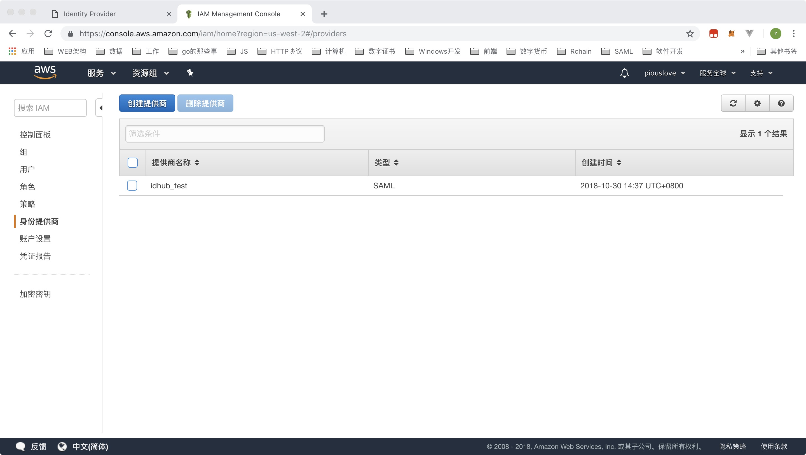
 1. 进入 AWS IAM 角色页面创建AWS角色
 
 1. 点击 ‘创建角色’ 按钮进入创建角色页面（参考 https://docs.aws.amazon.com/zh_cn/IAM/latest/UserGuide/id_roles_create_for-idp.html ）
 
 1. 选择 ‘SAML 2.0 身份联合’ 并选择SAML提供商和访问类别，然后点击下一步
 
 1. 为正在创建的角色选择AWS权限策略然后点击下一步
 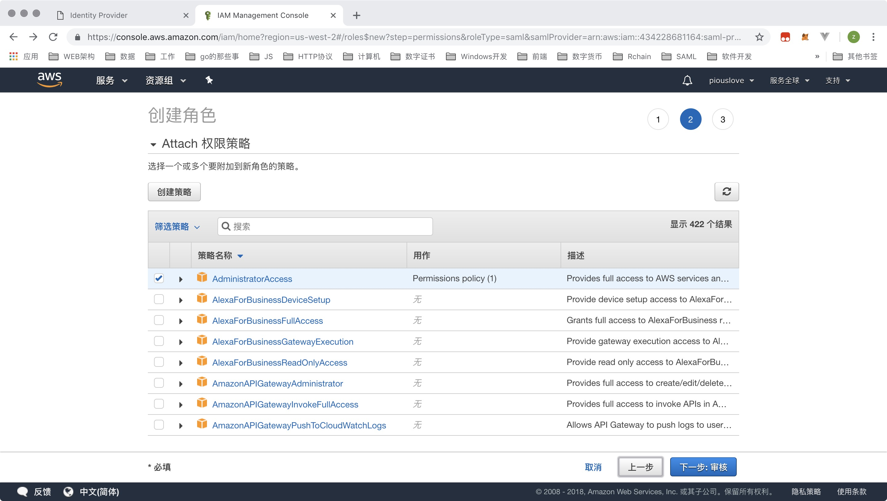
 1. 填写角色名称和描述，然后点击 ‘创建角色’ 按钮
 
 1. 成功创建新的AWS角色
 
 1. 获取身份提供商 ARN 数据以便在 aws-demo 中注册组织用户使用（参考第2.5节 ‘注册并配置组织用户’ 第6步骤）
 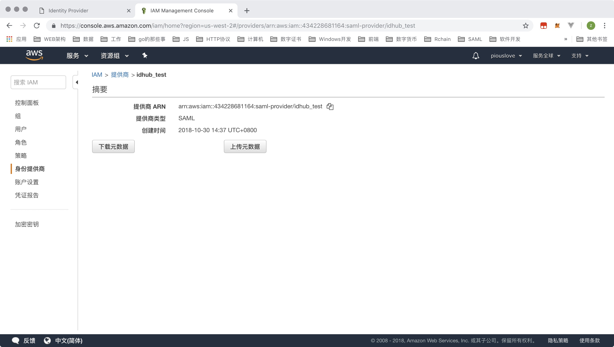
 1. 获取角色 ARN 数据以便在 aws-demo 中注册组织用户使用（参考第2.5节 ‘注册并配置组织用户’ 第6步骤）
 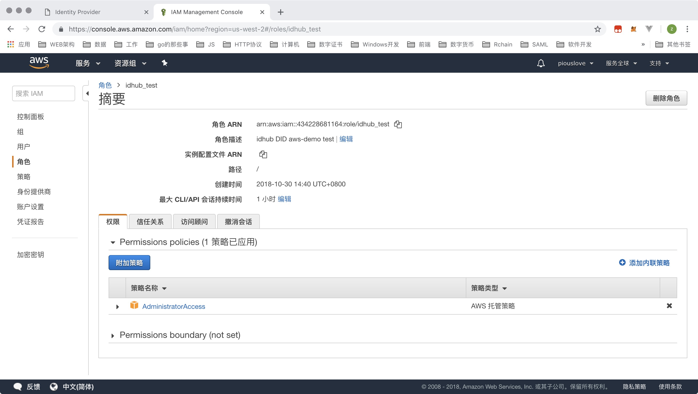

### 2.5 注册并配置组织用户
在 AWS 上配置好权限和角色后，回到 IDHub 身份提供商管理平台，成为一名组织用户。
 1. 进入 ‘元数据管理’ 页面
 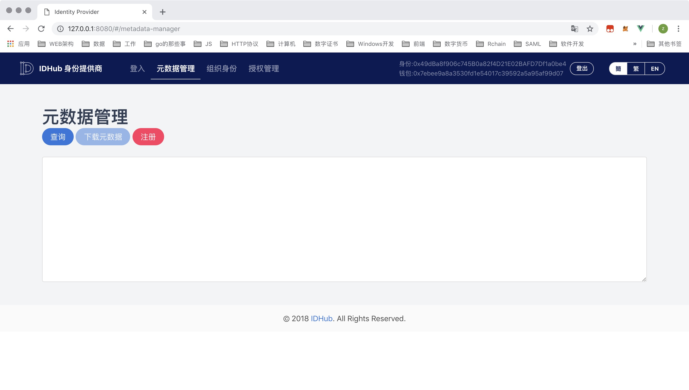
 1. 点击红色的 ‘注册’ 按钮为当前登录的DID生成组织用户的元数据
 
 1. 点击 ‘查询’ 按钮查看当前登录的DID的元数据
 
 1. 点击 ‘下载元数据’ 按钮下载当前登录的DID的元数据（.xml文件）
 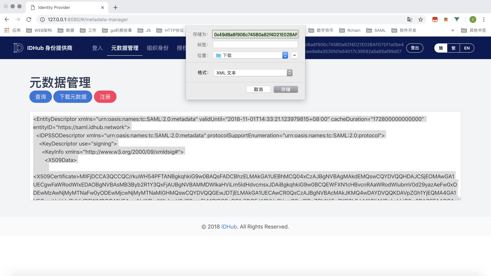
 1. 进入 ‘组织身份’ 页面并点击 ‘注册’ 按钮
 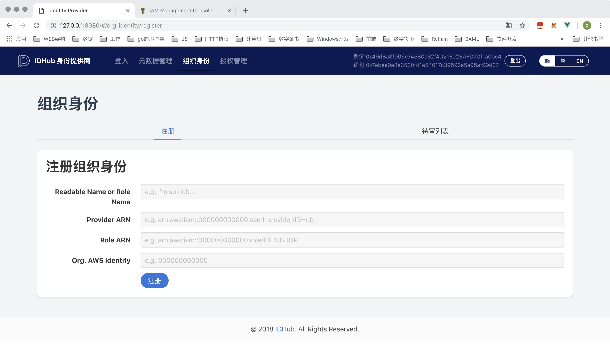
 1. 填写当前登录的 AWS 信息（参考第2.4节 ‘AWS SAML 配置’）
 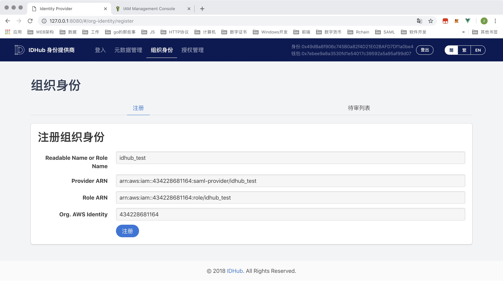
 1. 点击最下面的 ‘注册’ 按钮，成功之后在 ‘授权管理’ 页面下点击 ‘申请授权’ 按钮可以看到供申请的组织用户
 
 1. 使用其他DID登录后也可以看到供申请的组织用户
 
 1. 由普通用户申请之后，组织用户可以在 ‘组织身份’ 页面下点击 ‘待审列表’ 查看已申请信息并点击 ‘approved’ 或者 ‘rejected’ 按钮通过或拒绝请求
 
