# AWS DID User Manual

## Contents
- [1 Introduction](#1-Introduction)  
- [2 How to Use](#2-How-to-Use)
  - [2.1 Get Started](#21-get-started-obtain-your-first-did-key)
  - [2.2 Login with DID](#22-login-with-did)
  - [2.3 Login AWS as Ordinary User](#23-login-aws-as-ordinary-user)
  - [2.4 AWS SAML Configuration](#24-aws-saml-configuration)
  - [2.5 Register and Setup for Organizational User](#25-register-and-setup-for-organizational-user)

## 1 Introduction

AWS-Demo is an application, which utilizes Ethereum-based IDHub Decentralized Identity (DID) for certification and authorization. AWS-Demo could offer:
1.	Users can login AWS Management Console with Ethereum Wallet
2.	AWS users can authorize specified users to access specified operation
3.	Operating Permission settings are programmable through smart contract on blockchain, so that digital currency can be associated with login and operating permission. And unexpected business model is expanded. (In Process)

## 2 How to Use
### 2.1 Get Started: Obtain Your First DID Key
In IDHub DID, any ethereum address is default recognized as its DID key, which means if you own an ethereum wallet, you have already obtained DID. AWS-Demo now can support Metamask wallet login. Download [Metamask](https://metamask.io), and obtain your first DID key.

### 2.2 Login with DID
> **Tips:**
1. ***Login*** means login AWS Management Console, while ***Signin*** means signin our Platform ‘IDHub Identity Provider’ in the manual.
2. Screenshots below are in Chinese at present. Welcome to push requests on github if you have got the English ones.
3. Want to become one of us (contributor, or anything), or if you have any question, please contact: support@idhub.network

After installing Metamask wallet, let’s use it to login ‘IDHub Identity Provider’ management platform.
1.	Access to ‘Signin’ page and enter your DID 
 
2.	Click ‘Get Booking Message’ to obtain sign information
3.	Click ‘Signin’
4.	When you see ‘Metamask Notification’ Interface pops up, click ‘Sign’ to start the process
 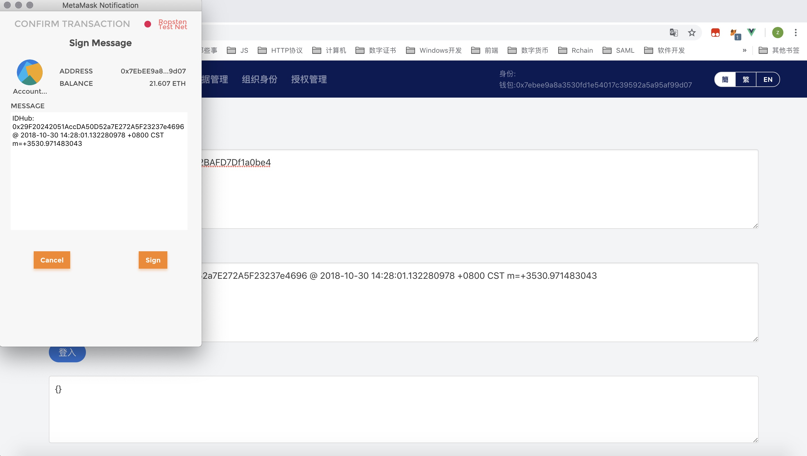
5.	Verification will be sent automatic after Sign
6.	Access to AWS-Demo system after successful verification
 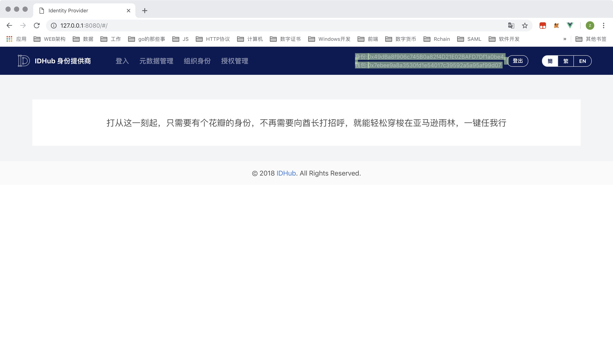

### 2.3 Login AWS as Ordinary User
After finishing Signin process, you have become an IDHub Ordinary User. The first function IDHub provides to its users is to login AWS, The servers IDHub using run on AWS, and open an read-only access to Ordinary Users. By completing this session, you are able to browsing any IDHub development servers deployment and operating status.

1.	Login AWS with DID, then enter ‘Authorization’ page, and click on ‘Apply Authorization’ sub-menu
 
2.	Review and choose an applicable role provided by Organizational User, then click ‘apply’. At this time, the ‘apply status’ becomes 0, means pending for approval
 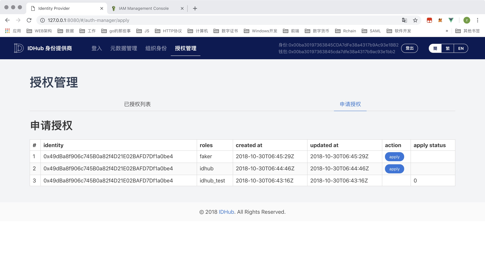 
3.	Send your DID key to support@idhub.network, waiting for Organizational Users’ approval (see Section 2.5 ’Register and Setup for Organizational User’ Step 9)  
 
4.	After approval, Ordinary Users can see the application had been approved by clicking ‘apply authorization’ button on ’Authorization’ page: ‘apply status’ turns to 1, means application approved. 
 
5.	Ordinary Users can click on ‘Authorizations List’ to view the approved list of authorizations
 
6.	Click ‘Get SAML’ to view SAML_RESPONSE, it will appear in the text box on screen
 
7.	Click ‘AWS I’m coming…’ in yellow, then you can use SAML_RESPONSE to login AWS website 
 

### 2.4 AWS SAML Configuration
Get your IDHub access? Cool! If you are a developer, feel free to open your own server permissions, and become a Organizational User. In this session, we will introduce basic configuration of AWS SAML, if you have already been familiar with AWS SAML and united identity, please have a quick look and skip to next session: 2.5 Register and SetUp for organizational user.

Reference: https://docs.aws.amazon.com/zh_cn/IAM/latest/UserGuide/id_roles_providers_saml.html
1.	Login AWS website and enter IAM Identity Provider page
(reference:  https://docs.aws.amazon.com/zh_cn/IAM/latest/UserGuide/id_roles_providers_create_saml.html) 
 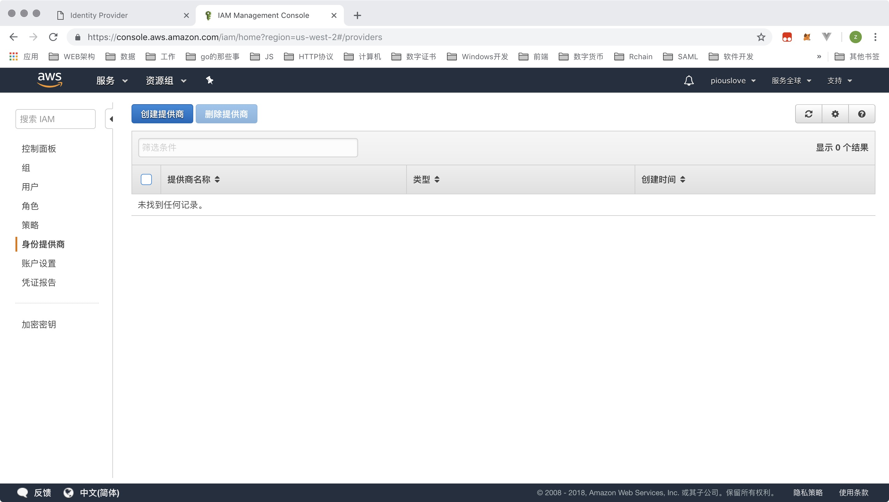
2.	Click ‘Create Provider’ and enter configuration page, fill in the provider’s name and metadata document (see Section 2.5 step 4), and then click Next
 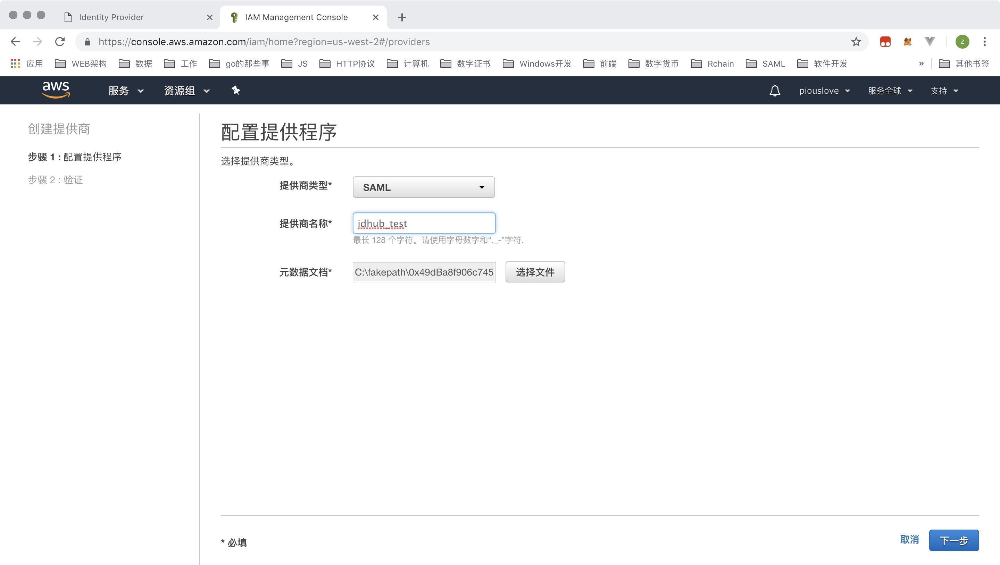
3.	Successfully create your Identity Provider 
 
4.	Enter AWS IAM ‘Role’ page to create AWS roles 
 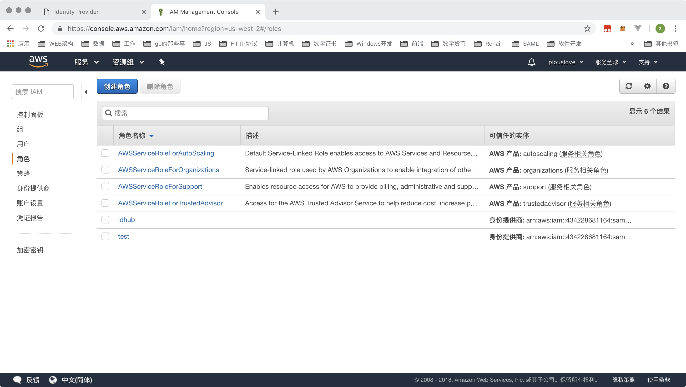
5.	Click ‘Create Roles’ to enter the Role Creation page
(reference:  https://docs.aws.amazon.com/zh_cn/IAM/latest/UserGuide/id_roles_create_for-idp.html ) 
 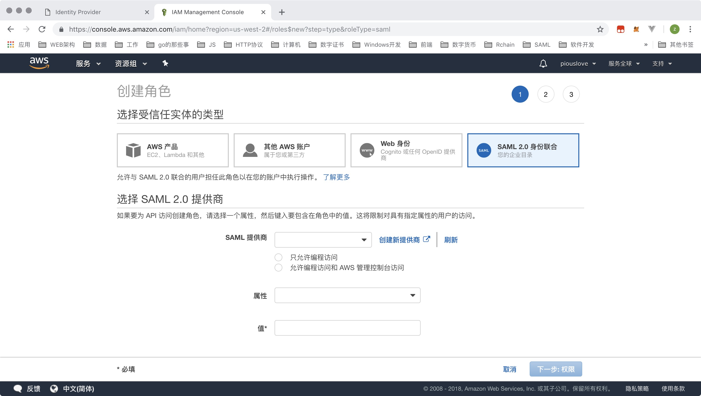
6.	Select ‘SAML 2.0 federation’ and select SAML provider and access type, then click ‘Next:Permissions’
 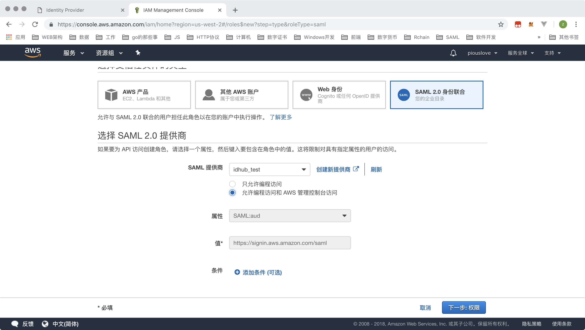
7.	Select AWS Permissions policies for roles you are creating, and then click Next
 
8.	Fill in the Name and Description for your roles, and click ‘Create Roles’
 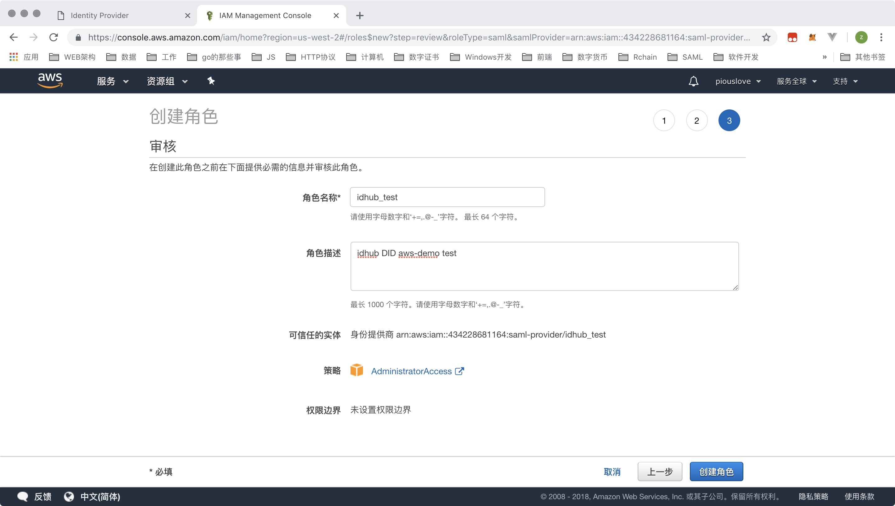
9.	Successfully create new AWS roles 
 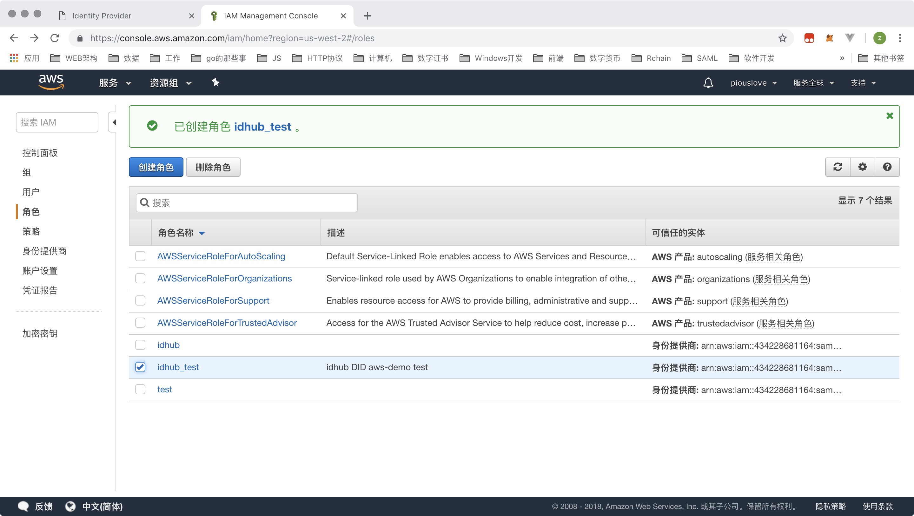
10.	Obtain Identity Provider ARN data in order to register Organizational User (see Section 2.5 ’Register and Setup for organizational user’ Step 6)
 
11.	Obtain roles’ ARN data in order to register Organizational User (see Section 2.5 ’Register and Setup for organizational user’ Step 6)  
   

### 2.5 Register and Setup for Organizational User
After finishing permission and role configuration on AWS, back to IDHub Identity Provider platform, and become a Organizational User.
1.	Enter ‘Metadata’ page 
 
2.	Click on ‘Register’ button in red to generate metadata for the currently logged-in DID
 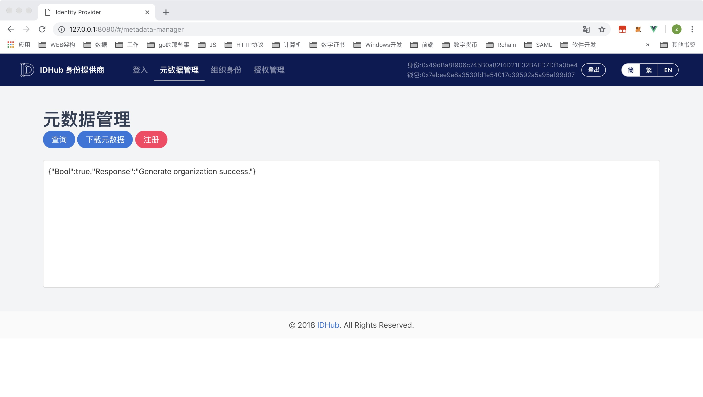
3.	Click ‘Query’ to review the metadata of currently logged-in DID 
 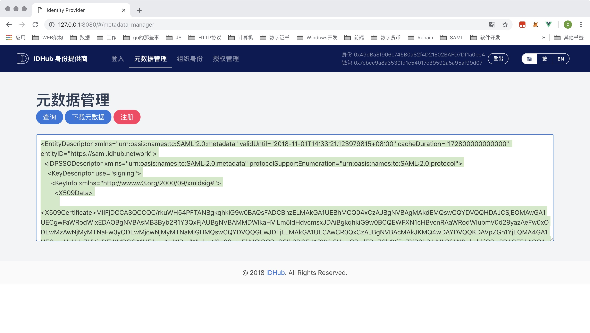
4.	Click ‘Download Metadata’ to download current DID’s metadta (.xml file) ]
 
5.	Enter ‘Org. ID’ page and click ‘Register’ 
 
6.	Fill in current logged-in AWS information (see Section 2.4 ‘AWS SAML configuration) 
 
7.	Click ‘Register’ button at the very bottom; after finish, click ‘apply for authorization’ on ‘Authorization’ page to review Organizational Users for application
 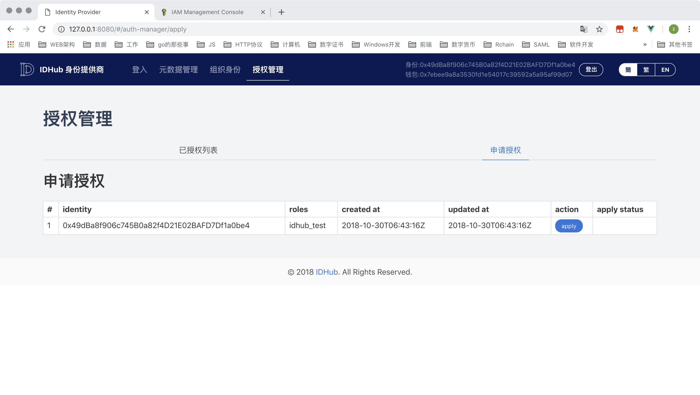
8.	Use other DID to signin, also can see Organizational Users for application
 
9.	After Ordinary Users’ application, Organizational Users can review applied-status by clicking ‘Pending List’ on ‘Org. ID’ page, and choose to approve or reject an application by click ‘approved’ or ‘rejected’ respectively.
 
